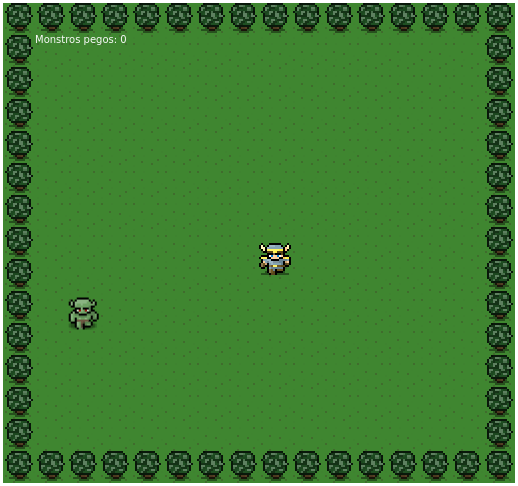

# Mini-GameJS

Projeto feito para aprender um pouco mais sobre ES6

## Principais objetivos do projeto

- Relembrar conteudo
- Estudos sobre o uso do babel

## Exemplo

## Continua nos proximos episódios :)
